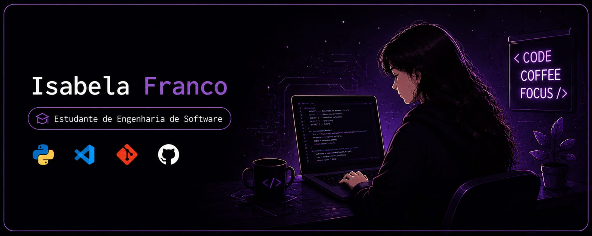

  

# 👋 Olá, eu sou a Isabela

### 💜 Estudante de Engenharia de Software

Atualmente estudando desenvolvimento de software e criando projetos para evoluir minhas habilidades.

---

## 🌙 Sobre mim

- 🐍 Estudando Python
- 🌐 Aprendendo HTML, CSS e JavaScript
- 🎮 Interesse em jogos e tecnologia
- 📚 Sempre aprendendo novas tecnologias

---

## 🚀 Tecnologias

---

## 📊 Estatísticas GitHub

---

## 🌐 Redes

---

✨ Obrigada por visitar meu perfil ✨

